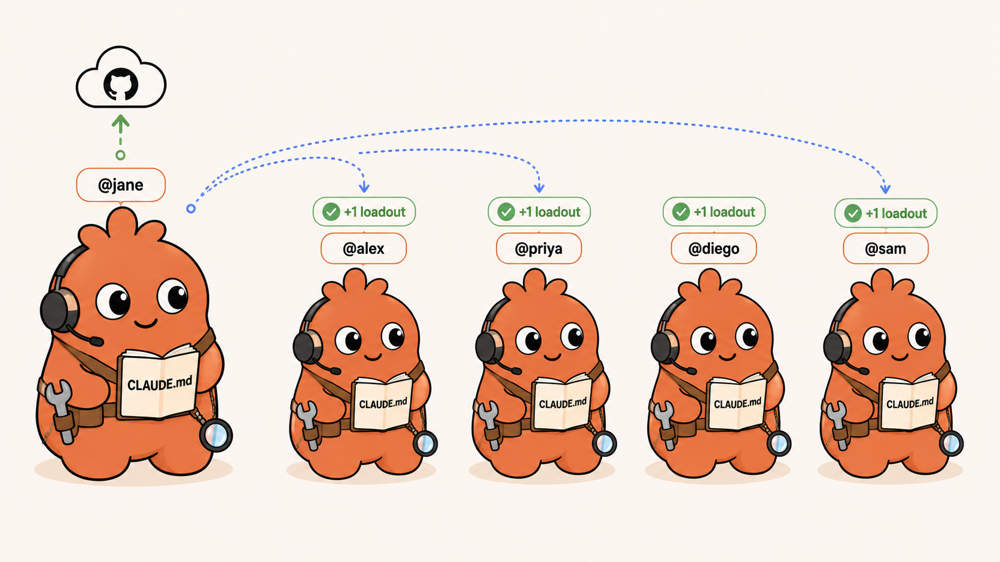
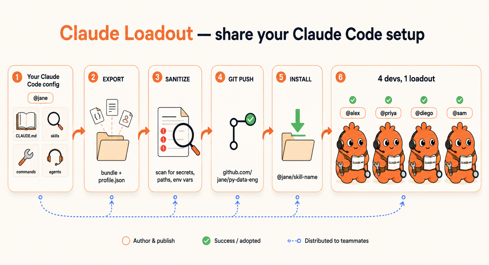
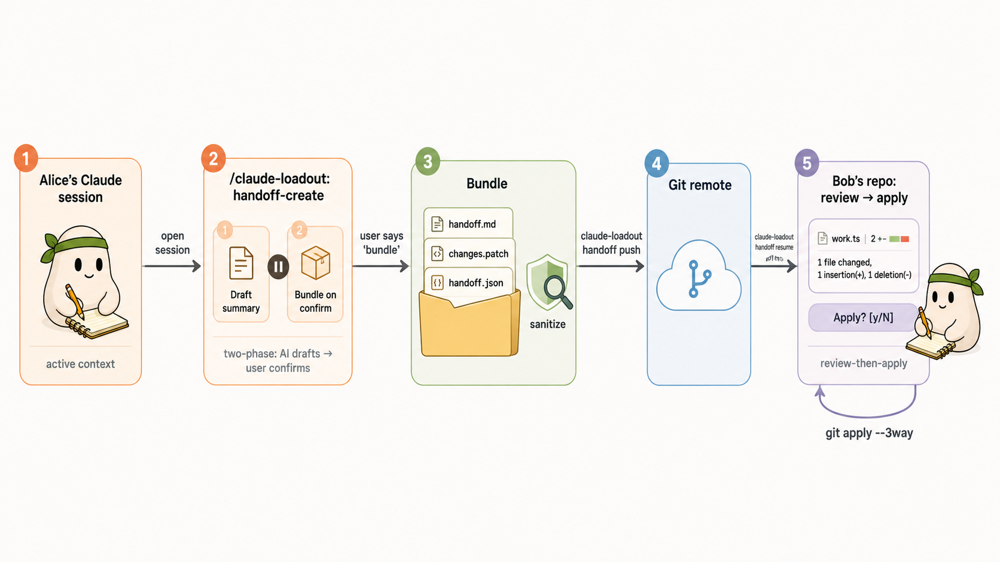

# Claude Loadout

> **Share your Claude Code setup like dotfiles.**
>
> A Claude Code plugin that bundles your `CLAUDE.md`, skills, slash commands, and sub-agents into a portable **loadout** any other Claude Code user can install with one command.

[](https://github.com/TusharKarkera22/claude-loadout/actions/workflows/ci.yml) [](./LICENSE) [](./package.json)



---

## The pitch

Every Claude Code user gradually shapes their workflow with a personal mix of CLAUDE.md rules, custom skills, slash commands, and sub-agents. Today there is no standard way to share that. Devs end up emailing snippets, screenshotting setups, or copy-pasting skill files into Slack.

**Claude Loadout** treats your config like a gamer's loadout: a complete equipped set of gear you can publish once and let any teammate adopt — without disturbing their own gear.

```bash
# Bundle your setup
claude-loadout export --name py-data-eng --description "Python + dbt + Snowflake setup"

# Push it to GitHub. A teammate then runs:
claude-loadout install jane/py-data-eng

# Their Claude now has @jane/snowflake-explain, @jane/dbt-debug, @jane/data-reviewer
# — namespaced under @jane so their own setup is untouched.
```

---

## How it works



The pipeline is six stages, from author to adopters:

1. **Your Claude Code config** — `CLAUDE.md`, skills, commands, sub-agents.
2. **Export** — bundled into a directory with a validated `profile.json` manifest.
3. **Sanitize** — scans the bundle for secrets, absolute home paths, and `*_KEY=` style assignments.
4. **Git push** — the bundle becomes a public (or private) repo on GitHub / GitLab / anywhere with Git.
5. **Install** — anyone runs `claude-loadout install owner/repo` to fetch and validate it.
6. **Adopters** — the loadout's items appear under `@author/...` in their Claude Code session, namespaced so nothing of their own is overwritten.

On the adopter's disk, an installed loadout looks like this:

```
~/.claude-loadout/jane-py-data-eng/
   skills/snowflake-explain/SKILL.md
   commands/dbt-debug.md
   agents/data-reviewer.md
   CLAUDE.md
   profile.json    ← validated manifest
   .install.json   ← source, ref, install date
```

---

## Install in Claude Code

Run these two commands inside any Claude Code session:

```text
/plugin marketplace add TusharKarkera22/claude-loadout
/plugin install claude-loadout@claude-loadout
```

The first line registers this repo as a one-plugin marketplace, the second installs the plugin from it. After that, `/loadout export`, `/loadout install`, and the rest are available as native slash commands.

> Plugins can run code on your machine. Read [`SECURITY.md`](./SECURITY.md) before installing anything from a stranger.

---

## Quickstart (clone-and-build, for hacking on the source)

```bash
# 1. Setup
git clone https://github.com/TusharKarkera22/claude-loadout.git && cd claude-loadout
npm install
npm run build

# 2. Bundle your current Claude Code config
node dist/cli.js export \
  --source . \
  --out  ./my-loadout \
  --name my-loadout \
  --description "Tushar's Azure data-eng workflow" \
  --author your-github-handle

# 3. (Optional) Re-scan an existing loadout for secrets
node dist/cli.js sanitize ./my-loadout

# 4. Push it
cd my-loadout && git init && git add . && git commit -m "Initial loadout" && \
  gh repo create your-handle/my-loadout --public --source=. --push

# 5. A teammate installs it
node dist/cli.js install your-handle/my-loadout

# 6. Manage installed loadouts
node dist/cli.js list
node dist/cli.js show   your-handle-my-loadout
node dist/cli.js update your-handle-my-loadout
node dist/cli.js remove your-handle-my-loadout
```

After `npm link` (or once published) the binary is exposed as `claude-loadout`, so the same flows become `claude-loadout export …`, `claude-loadout install …`, etc.

The same operations are exposed as `/loadout *` slash commands once the plugin is loaded into Claude Code.

---

## Subcommand reference

| Command | What it does |
|---|---|
| `claude-loadout export` | Scan `CLAUDE.md` + `.claude/{skills,commands,agents,hooks}/`, copy them into a loadout, write a validated `profile.json`. Refuses to clobber a non-empty output dir. |
| `claude-loadout sanitize <dir>` | Walk a loadout, flag AWS / GitHub / Anthropic / OpenAI keys + absolute home paths + `*_KEY=` style assignments. Exit code 2 if any high-severity findings. |
| `claude-loadout install <src>` | Resolve `owner/repo` shorthand or a full Git URL, validate the manifest, copy declared items into `.claude-loadout/<author>-<name>/`. Hooks are skipped unless `--allow-hook-import`. |
| `claude-loadout list` | Print installed loadouts with version, author, install date. |
| `claude-loadout show <alias>` | Pretty-print the manifest of an installed loadout. |
| `claude-loadout update <alias>` | Re-fetch the recorded source. Stages to `<alias>.update-staging` and atomic-swaps so a failed update never corrupts the existing install. |
| `claude-loadout remove <alias>` | Uninstall. Aliases are checked against path traversal — you cannot escape `profilesDir`. |
| `claude-loadout handoff create` | Bundle the current session as a handoff: AI-drafted summary + binary-safe diff of every uncommitted change + validated manifest. Sanitize runs automatically. |
| `claude-loadout handoff resume <src>` | Fetch a teammate's handoff bundle (Git URL / `owner/repo` / local path), show the summary + diff, prompt before applying via `git apply --3way`. Auto-checks out the author's branch by default. |
| `claude-loadout handoff push <bundle> --remote <url>` | Init+commit+push a handoff bundle to a Git remote. |

---

## Team handoff (v0.2)


Handing off in-progress work between teammates is the second feature shipped on top of the v0.1 plumbing. Use it when you're logging off mid-task and want a teammate to pick up exactly where you stopped — uncommitted edits, partial mental model, and all.

> The whole point: the **AI summary** is drafted from your live session context (what was discussed, what was tried, what's pending) — something you can't reproduce by piping `git diff` into Slack. Everything else is convenience around that.

### Alice publishes a handoff (two-phase, review-before-bundle)

```bash
# Inside Claude Code:
/claude-loadout:handoff-create --out ./handoff-thursday --author alice
```

Phase 1 — Claude reads the session and drafts a structured `handoff.md` (what was done, what's pending, files touched, decisions, suggested next move). Then it **stops** and shows Alice the draft.

Alice can edit the draft directly in her editor (it's plain markdown at `${TMPDIR}/loadout-handoff-summary.md`), or accept as-is.

Phase 2 — Alice replies `bundle` (or `cancel` to drop it). Only then does the CLI capture the git diff, run sanitize, and write the validated bundle. No surprise commits, no one-shot summary stuck with whatever Claude produced first.

```bash
# Push it where Bob can find it:
claude-loadout handoff push ./handoff-thursday --remote git@github.com:alice/handoffs.git
```

### Bob picks it up (review-then-apply)

```bash
# Inside Claude Code:
/claude-loadout:handoff-resume git@github.com:alice/handoffs.git --repo .
```

Bob's flow is symmetric: the CLI fetches the bundle, validates the manifest, and runs `git apply --stat` so Bob sees scope before deciding:

```
work.ts |    2 +-
src/auth/middleware.ts | 47 +++++++++++++++++++--
2 files changed, 45 insertions(+), 4 deletions(-)
```

Then Claude surfaces Alice's full summary, and **explicitly asks Bob** before applying. Bob types `y`; the patch lands; Claude proposes the first concrete next step from Alice's "what's pending" list.

Same flow from a terminal: `claude-loadout handoff resume <url>` prints the diff stat and prompts `Apply this patch? [y/N]` when stdin is a TTY. Pass `--yes` to bypass in scripts; pass `--no-apply` to review without applying.

### Pipeline at a glance



### What's in the bundle

```
handoff-thursday/
   handoff.md       ← AI-drafted summary, reviewed and edited by Alice
   changes.patch    ← binary-safe diff of every uncommitted change (tracked + staged + untracked)
   handoff.json     ← zod-validated manifest: id, branch, baseCommit, repoUrl, author, sanitized stats
```

### Safety defaults

- **Two-phase create** — Claude never auto-bundles a draft; Alice always gets a chance to edit or cancel.
- **Diff stat preview** — Bob sees how big the patch is before he says yes.
- **Confirm-before-apply** — `handoff resume` prompts on TTY by default; non-interactive callers (CI, slash commands) auto-apply unchanged for ergonomics.
- **Sanitize on create** — high-confidence secret findings (AWS / GitHub PAT / Anthropic / OpenAI keys) block the bundle unless you re-run with `--allow-findings`.
- **Dirty-tree refusal** — `handoff resume` refuses to clobber uncommitted work unless `--allow-dirty` is passed.
- **Auto-checkout with smart fallback** — by default Bob is moved to Alice's branch; if Alice's `baseCommit` isn't in Bob's local history, `--3way` degrades to plain `git apply` with a visible warning rather than silently failing.

---

## Configuration

Drop a `claude-loadout.config.json` in your project root. Anything you omit falls back to defaults.

```json
{
  "export": {
    "outputDir": "./my-loadout",
    "include": {
      "claudeMd": true,
      "skills": true,
      "commands": true,
      "agents": true,
      "hooks": false
    }
  },
  "sanitize": {
    "allow": [],
    "deny": ["my-org\\.local", "internal\\.svc\\.cluster"],
    "redactAbsolutePaths": true,
    "redactEnvAssignments": true
  },
  "install": {
    "profilesDir": ".claude-loadout",
    "namespacePrefix": "@",
    "allowHookImport": false
  },
  "author": {
    "handle": "your-github-handle",
    "displayName": "Your Name"
  }
}
```

See `claude-loadout.config.json.example` for the full shape.

---

## Safety model

Claude Loadout splits a loadout's contents into two classes and treats them very differently:

| Class | Examples | Behavior on install |
|---|---|---|
| **Declarative** | `CLAUDE.md`, skills, slash commands, sub-agents | Copied into `.claude-loadout/<alias>/` and namespaced by directory. Imported `CLAUDE.md` is **never auto-merged** into yours — you opt in section by section. |
| **Executable** | Hooks (shell scripts the harness runs) | **Skipped by default.** Importing hostile shell from a stranger's repo is the obvious supply-chain risk; v0.1 forbids it. Override per-install with `--allow-hook-import`. v0.2 will add an explicit consent flow. |

The sanitize pass is **best-effort, not a security guarantee**. Always review your loadout before pushing. The high-confidence regex catalogue covers the easy footguns (AWS access keys, GitHub PATs, Anthropic / OpenAI API keys, `/Users/<you>/`, `MY_*_KEY=`); it does not catch every secret you might paste into a CLAUDE.md.

---

## Architecture

```
src/
├── manifest/
│   ├── schema.ts              ← zod schema for profile.json (loadouts)
│   ├── handoff-schema.ts      ← zod schema for handoff.json (v0.2)
│   └── validator.ts
├── adapters/
│   ├── storage.interface.ts   ← StorageAdapter contract
│   └── git-storage.ts         ← Git-backed implementation (fetch + publish)
├── modules/
│   ├── export/index.ts        ← Module A — bundle current config
│   ├── sanitize/index.ts      ← Module B — secret/path scanner + applyRedactions
│   ├── install/index.ts       ← Module C — fetch, validate, namespaced install
│   ├── manage/index.ts        ← Module D — list / show / update (atomic) / remove
│   └── handoff/               ← Module E (v0.2) — team handoff
│       ├── index.ts           ← createHandoff: capture summary + diff + manifest
│       ├── git-state.ts       ← branch / baseCommit / repoUrl + binary-safe diff
│       └── resume.ts          ← resumeHandoff: validate + checkout + apply
├── config/
│   └── loader.ts              ← Per-project claude-loadout.config.json with defaults
├── cli/
│   ├── parse-args.ts          ← Zero-dep flag parser
│   ├── run.ts                 ← runCli(argv): Promise<number>
│   └── handlers/              ← One zod-validated handler per subcommand
├── hooks/
│   └── session-end.ts         ← Stub — SessionEnd auto-archive (future)
└── cli.ts                     ← Process entry point
```

**Extension points** (where v0.2+ work plugs in without core changes):

| You want to add… | Where | What to implement |
|---|---|---|
| New storage backend (S3, Notion, Postgres) | `src/adapters/<name>-storage.ts` | `StorageAdapter` interface |
| New sanitize rule | `src/modules/sanitize/index.ts` | Append to `HIGH_CONFIDENCE_PATTERNS` |
| New module (e.g. `diff`) | `src/modules/<name>/index.ts` + `src/cli/handlers/<name>.ts` | Add subcommand to `SUBCOMMANDS` in `cli/run.ts` |
| Lifecycle hook (e.g. team-handoff) | `src/hooks/<event>.ts` | Wire in `.claude-plugin/plugin.json` |

---

## Status & roadmap

**v0.2.0 (current) — shipped:** v0.1's loadout pipeline (export / sanitize / install / manage) **plus** team handoff: AI-drafted summary with two-phase review, `git apply --3way` resume with diff stat preview and TTY confirmation, `GitStorageAdapter.publish()`. 106 tests, production bundle via esbuild (`bin/cli.cjs`).

**v0.3+:** SessionEnd auto-archive, Slack/Discord notifications, hook import with consent flow, GitHub-topic-based discovery site, versioning + pinning, loadout composition, `claude-loadout diff`, starter templates.

**v1.0:** cloud storage adapters, approval gates, peer review.

Full backlog with extension points: [`ROADMAP.md`](./ROADMAP.md).

---

## Development

```bash
npm install
npm run typecheck     # tsc --noEmit on src/ + tests/
npm test              # vitest run — currently 55 tests across 8 files
npm run test:watch    # interactive
npm run build         # tsc -> dist/, produces dist/cli.js
```

Tests live under `tests/`, mirror the `src/` layout, and rely on a `LocalStorageAdapter` test fake (`tests/helpers/local-storage.ts`) so install / manage tests never touch the network.

---

## Contributing

PRs that extend modules, add storage adapters, or land v0.2 features against the documented extension points are very welcome. Please add a test (the suite is fast — under 300ms) and keep `npm run typecheck` green.

---

## License

[MIT](./LICENSE)
